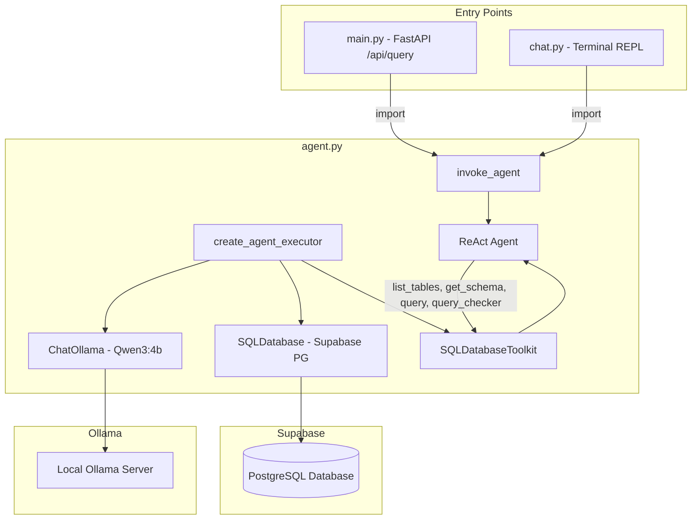
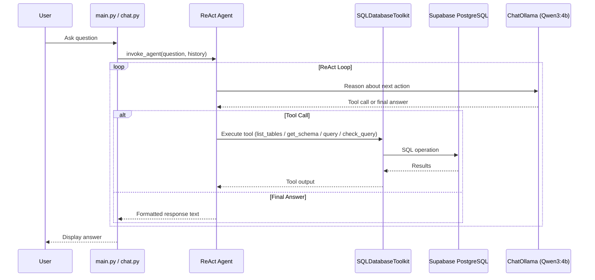

# Design Document: LangChain SQL Agent

## Overview

This design converts the AU-Ggregates AI Data Lookup from a manual 3-stage Ollama HTTP pipeline to a LangChain SQL agent architecture. The current system uses three sequential LLM calls (Intent Extraction → SQL Generation → Response Formatting) with custom prompt engineering, manual SQL extraction/validation, and direct `requests` calls to Ollama. The new architecture replaces all of this with a single LangChain ReAct agent that autonomously decides when to inspect schema, generate SQL, execute queries, and format responses.

The core change is introducing an `agent.py` module that creates a `ChatOllama` → `SQLDatabase` → `SQLDatabaseToolkit` → ReAct agent pipeline. Both `main.py` (FastAPI) and `chat.py` (terminal) import from this module, eliminating duplicated pipeline logic. The `prompts.py` file is replaced by a single system prompt embedded in the agent module.

### Key Design Decisions

1. **`create_react_agent` over `create_sql_agent`**: LangChain's `create_sql_agent` is a legacy wrapper. The current recommended pattern uses `create_react_agent` with `SQLDatabaseToolkit` tools, which gives us a standard ReAct loop with full control over the system prompt.

2. **`ChatOllama.reasoning` parameter for think blocks**: Instead of regex-stripping `<think>...</think>` blocks post-hoc, `ChatOllama` from `langchain-ollama` supports a `reasoning` parameter that natively handles Qwen3's think blocks, separating reasoning content from the final answer at the API level.

3. **`OLLAMA_URL` base URL change**: The current `.env` sets `OLLAMA_URL=http://localhost:11434/api/generate` (the raw generate endpoint). `ChatOllama` expects the base URL (`http://localhost:11434`). The agent module will use a new `OLLAMA_BASE_URL` env var defaulting to `http://localhost:11434`, or strip `/api/generate` from the existing `OLLAMA_URL` for backward compatibility.

4. **Read-only enforcement at two layers**: The system prompt instructs the agent to only generate SELECT queries, and the `SQLDatabase` connection is configured with `sqlalchemy` execution options to reject writes. This provides defense-in-depth.

5. **Conversation history via message list**: Rather than formatting history as a string, the agent accepts a list of `HumanMessage`/`AIMessage` objects that are prepended to the agent's message input, giving the LLM native chat context.

## Architecture



### Agent Execution Flow



## Components and Interfaces

### 1. `agent.py` — Core Agent Module

This is the new shared module that replaces `prompts.py` and the duplicated pipeline logic in `main.py`/`chat.py`.

```python
# Public API
def create_agent_executor() -> AgentExecutor:
    """
    Creates and returns a configured LangChain SQL agent executor.
    Reads DATABASE_URL, OLLAMA_BASE_URL, OLLAMA_MODEL from environment.
    Raises ConnectionError if Ollama is unreachable.
    """

def invoke_agent(
    agent_executor: AgentExecutor,
    question: str,
    conversation_history: list[dict] | None = None
) -> str:
    """
    Invokes the agent with a question and optional conversation history.
    Returns the agent's text response.
    
    conversation_history: list of {"question": str, "answer": str} dicts,
    last 5 entries used. Converted to HumanMessage/AIMessage internally.
    """
```

Internal components created by `create_agent_executor()`:

| Component | Class | Configuration |
|-----------|-------|---------------|
| LLM | `ChatOllama` | model=`OLLAMA_MODEL`, base_url=`OLLAMA_BASE_URL`, temperature=0.1, reasoning=True |
| Database | `SQLDatabase` | from_uri(`DATABASE_URL`), include_tables=[...14 tables...] |
| Toolkit | `SQLDatabaseToolkit` | db=database, llm=llm |
| Agent | `create_react_agent` | llm, tools, system prompt |
| Executor | `AgentExecutor` | agent, tools, handle_parsing_errors=True |

### 2. `main.py` — FastAPI Server (Simplified)

Stripped of all pipeline functions. Imports `create_agent_executor` and `invoke_agent` from `agent.py`.

```python
# Simplified endpoints
@app.post("/api/query")
async def query_data(req: QueryRequest) -> QueryResponse:
    # Validates question, calls invoke_agent, returns response

@app.get("/health")
async def health() -> dict:
    # Returns status + model name
```

Response model simplified:

```python
class QueryRequest(BaseModel):
    question: str
    conversation_history: list[dict] = []

class QueryResponse(BaseModel):
    question: str
    answer: str
```

The `intent`, `sql`, and `data` fields are removed from `QueryResponse` since the agent handles these internally. The API contract simplifies to question-in, answer-out.

### 3. `chat.py` — Terminal Chat (Simplified)

Stripped of all pipeline functions. Maintains a session-level conversation history list and passes it to `invoke_agent`.

```python
def main():
    agent_executor = create_agent_executor()
    conversation_history: list[dict] = []
    
    while True:
        question = input("📝 You: ").strip()
        # ... exit handling ...
        answer = invoke_agent(agent_executor, question, conversation_history)
        print(answer)
        conversation_history.append({"question": question, "answer": answer})
        # Trim to last 5
        if len(conversation_history) > 5:
            conversation_history = conversation_history[-5:]
```

### 4. System Prompt

The Querymancer-style system prompt is defined as a constant in `agent.py`. It combines the personality/formatting instructions from the current `SYSTEM_PROMPT` in `prompts.py` with SQL agent-specific directives.

```python
SYSTEM_PROMPT = """You are AU-Ggregates Data Assistant, a master database engineer...

<instructions>
- Only generate SELECT queries. Refuse any INSERT/UPDATE/DELETE/DROP/ALTER/CREATE/TRUNCATE requests.
- Double-quote all PostgreSQL table and column names.
- Use ILIKE for case-insensitive text searches.
- Add LIMIT 100 to queries to prevent excessive results.
- Format monetary values as Philippine Peso (₱XX,XXX.XX).
- Accept questions in English or Taglish. Always respond in English.
- Format responses as Markdown, preferring tables or lists for data display.
- For expense/cashflow amounts, JOIN through the dynamic column tables
  (ExpensesTableTemplate -> ExpensesColumn -> ExpensesCellValue, etc.)
</instructions>

Today is {current_date}
"""
```

### 5. Files Removed

| File/Function | Reason |
|---------------|--------|
| `prompts.py` | Entire file replaced by system prompt in `agent.py` |
| `data_lookup.py` | CSV-based tool, not part of the SQL agent architecture |
| `main.py`: `ask_qwen`, `extract_json`, `extract_sql`, `execute_query`, `strip_think_blocks`, `format_history` | Pipeline functions replaced by agent |
| `chat.py`: `ask_qwen`, `ask_qwen_stream`, `extract_json`, `extract_sql`, `execute_query`, `strip_think_blocks`, `format_history`, `print_table`, `process_question` | Pipeline functions replaced by agent |

## Data Models

### Environment Variables

| Variable | Used By | Default | Notes |
|----------|---------|---------|-------|
| `DATABASE_URL` | `agent.py` -> `SQLDatabase` | (required) | PostgreSQL connection string for Supabase |
| `OLLAMA_BASE_URL` | `agent.py` -> `ChatOllama` | `http://localhost:11434` | Base URL for Ollama server (not the `/api/generate` endpoint) |
| `OLLAMA_MODEL` | `agent.py` -> `ChatOllama` | `qwen3:4b` | Model name for Ollama |

Note: The existing `OLLAMA_URL` env var points to `http://localhost:11434/api/generate`. The agent module will check for `OLLAMA_BASE_URL` first, then fall back to stripping `/api/generate` from `OLLAMA_URL` if present, for backward compatibility.

### Database Tables (include_tables list)

These are the tables passed to `SQLDatabase.from_uri()` via the `include_tables` parameter:

```python
INCLUDE_TABLES = [
    "Project",
    "Trip",
    "TruckDetails",
    "Expenses",
    "CashFlow",
    "product_category",
    "product",
    "Quotation",
    "QuotationItem",
    "ExpensesTableTemplate",
    "ExpensesColumn",
    "ExpensesCellValue",
    "CashFlowCustomTable",
    "CashFlowColumn",
    "CashFlowCellValue",
]
```

### Conversation History Format

The conversation history is passed between entry points and the agent module as a simple list of dicts:

```python
# Input format (from FastAPI request body or terminal session)
conversation_history: list[dict] = [
    {"question": "How many projects are active?", "answer": "There are 5 active projects."},
    {"question": "Which one has the most trips?", "answer": "Project Alpha has 42 trips."},
]
```

Internally, `invoke_agent` converts this to LangChain message objects:

```python
from langchain_core.messages import HumanMessage, AIMessage

messages = []
for entry in conversation_history[-5:]:
    messages.append(HumanMessage(content=entry["question"]))
    messages.append(AIMessage(content=entry["answer"]))
messages.append(HumanMessage(content=current_question))
```

### FastAPI Request/Response Models

```python
class QueryRequest(BaseModel):
    question: str
    conversation_history: list[dict] = []

class QueryResponse(BaseModel):
    question: str
    answer: str
```

### Agent Executor Configuration

```python
AgentExecutor(
    agent=react_agent,
    tools=toolkit.get_tools(),
    verbose=False,          # Set True for debug logging
    handle_parsing_errors=True,  # Graceful recovery from malformed LLM output
    max_iterations=10,      # Prevent infinite tool loops
    return_intermediate_steps=False,
)
```
